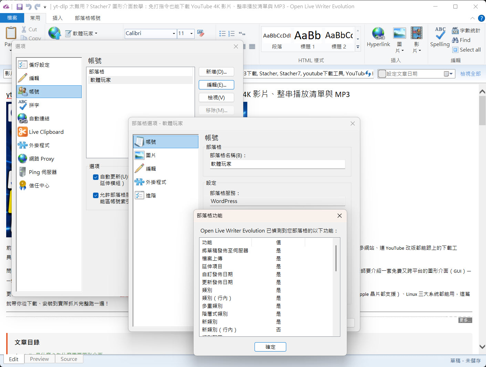

# Open Live Writer Evolution
Open Live Writer Evolution 讓您可以輕鬆撰寫、預覽並發布文章到您的部落格。
這是 Open Live Writer 的一個社群驅動分支（Fork），專注於現代 WordPress 相容性以及長期維護。



---

## 與 Open Live Writer 的差異

Open Live Writer Evolution 與上游的 [Open Live Writer](https://github.com/OpenLiveWriter/OpenLiveWriter) 專案有幾個重要的不同之處，皆旨在使編輯器能夠與現代 WordPress 網站和當代網頁佈景主題搭配使用。

### 1. IE11 渲染引擎（支援現代 CSS）

原始的 Open Live Writer 將其內嵌的 MSHTML 編輯器鎖定在 **IE9 模擬模式**（`IE=EmulateIE9`），因為 IE10+ 移除了 *Element Behaviors* —— 這是一個 IE 特有的 COM 擴充功能，在內部用於表格編輯、圖片操作和可編輯區域管理。

Open Live Writer Evolution 在執行時期透過以下方式將 MSHTML 升級為 **IE11 模式**：

- 在任何 MSHTML 元件初始化前（`ApplicationMain.cs`），將 `HKCU\SOFTWARE\Microsoft\Internet Explorer\Main\FeatureControl\FEATURE_BROWSER_EMULATION` 設為 `11001`（IE11 Edge 模式）。
- 將注入至編輯器範本的 `X-UA-Compatible` Meta 標籤從 `IE=EmulateIE9` 修改為 `IE=11`。

**為什麼這很重要：** IE9 完全不支援 `display: flex` 或 `display: grid`。現代的 WordPress 佈景主題（包括基於區塊的 Gutenberg 版面配置，以及 tagDiv/Newspaper 等佈景主題）皆依賴 Flexbox 和 CSS Grid 進行欄位排版。在原始的 OLW 中，任何使用這些屬性的內容在「編輯」和「預覽」分頁中都會崩塌成單一垂直欄位，即便在線上網站能正常渲染。IE11 原生支援 Flexbox 和 Grid，因此現在編輯器能正確反映網頁的實際版面。

### 2. 改進的 WordPress 佈景主題偵測

原始的部落格範本偵測器（`BlogEditingTemplateDetector`）使用 MSHTML DOM 走訪來定位已下載部落格頁面上的文章主體區域。然而，對於微軟不再支援且不再使用舊版 OLW 所預期的 Landmark ID 和 Class 的現代 WordPress REST/Gutenberg 網頁結構，這種方法會宣告失敗。

Open Live Writer Evolution 透過以下方式改進佈景主題偵測：

- 重寫 `BlogPostRegionLocatorStrategy`，使用 **基於字串的 GUID 搜尋** 取代 MSHTML DOM 走訪，使偵測對標記（Markup）的變更更具彈性與韌性。
- 為 WordPress 新增基於永久連結（Permalink）/ID 的目標網址指向，使偵測器抓取真正的單篇文章頁面，而非首頁，以提供更具代表性的範本。
- 透過 `CssFlexGridRewriter` 處理下載的範本 CSS 檔案，以正規化 Flex/Grid 規則，防止其干擾 IE 渲染管線。
- 修正 `HTMLDocumentHelper` 中載入複雜現代網頁時會導致無聲失敗的空值參考（Null-dereference）問題。

### 3. 背景顏色與樣式偵測修正

- 修正了 `PostEditorMainControl` 中的競態條件（Race Condition）——先前編輯器範本 HTML 在從下載的主題讀取背景顏色之前就已指派，導致佈景顏色被白底覆蓋。
- 修正了主題樣式表上的 CSS `media="not all"` 屬性（這是 WordPress 常用於延遲載入非關鍵 CSS 的技巧），使編輯器能載入完整的主題樣式，而非跳過它們。

### 4. 建置系統修正

- 將 `LocEdit.csproj` 的目標框架（Target Framework）從 `v4.7.2` 更新為 `v4.8`，以符合全域的 `writer.build.settings`，解決了多國語系編輯器工具中的 `CS0246` 建置錯誤。

---

## 更新日誌

### 2026-06-14
- **IE11 升級：** 透過 `FEATURE_BROWSER_EMULATION` 登錄檔鍵強制將 MSHTML 設為 IE11 模式；將 `X-UA-Compatible` 修改為 `IE=11`。Flexbox 和 CSS Grid 現在能在「編輯」與「預覽」分頁中正確渲染。
- **移除 IE9 CSS 模擬：** 從編輯器範本管線中移除了 `StylePreserver` 行內樣式重寫和 `CssFlexGridRewriter` 注入 —— 升級至 IE11 後已不再需要這些過渡方案。
- **建置修正：** `LocEdit.csproj` 的目標框架變更為 `v4.8`。

### 早期 (2026)
- 修正了 `BlogPostRegionLocatorStrategy` 中使用基於字串的 GUID 搜尋來處理 WordPress 佈景主題偵測的問題。
- 修正了 `PostEditorMainControl` 中的背景顏色偵測順序。
- 修正了下載的部落格範本中 `media="not all"` 樣式表被抑制的問題。
- 改進了 `HTMLDocumentHelper.StringToHTMLDoc` 和 `ResetPath` 的空值安全性。

---

## 螢幕截圖


---

## 安裝說明

### 免安裝綠色版（Portable）

從 [Releases](https://github.com/quicktop/OpenLiveWriterEvolution/releases) 頁面下載 `OpenLiveWriterEvolution-Portable.zip`，解壓縮到任何資料夾，然後執行 `OpenLiveWriter.exe`。使用者資料（設定、草稿、部落格範本）均儲存在執行檔旁的 `UserData\` 子資料夾中。

### 從原始碼建置

複製（Clone）或下載此儲存庫並從原始碼進行建置。請參閱下方的 **建置方法** 區段。

---

## 參與貢獻

Open Live Writer Evolution 是一個開源專案，歡迎社群參與貢獻。如果您想提供協助，請參閱 [參與貢獻說明](CONTRIBUTING.zh-TW.md)。

本專案已採用 [貢獻者公約 (Contributor Covenant)](http://contributor-covenant.org/) 定義的行為準則，以明確規範社群中的預期行為。

若要查看已知問題或回報 Bug，請前往 [Issues](https://github.com/quicktop/OpenLiveWriterEvolution/issues) 頁面。

---

## 授權條款

Open Live Writer Evolution 採用 [MIT 授權條款](license.txt)。

---

## 歷史背景

後來成為 Live Writer 的這款產品，最初是由 JJ Allaire、Joe Cheng、Charles Teague 和 Spike Washburn 等人組成的一個規模雖小但極具才華的工程師團隊所建立。該團隊於 2006 年被微軟收購，並與 Spaces 團隊合併。Becky Pezely 隨後加入，隨著時間推移，團隊不斷成長並發布了許多廣受歡迎的 Windows Live Writer 版本。

微軟在發布 Windows Live Writer 2012 後終止了主動開發。2015 年 12 月，微軟將程式碼捐贈給了 .NET Foundation，社群隨後將其作為 Open Live Writer 發布。

Open Live Writer Evolution 是 Open Live Writer 的進一步分支，持續開發並專注於現代部落格平台的相容性，特別是 WordPress。

---

## 建置方法

在目前目錄下執行 `build.ps1`（PowerShell）或 `build.cmd` 即可建置 Open Live Writer Evolution。

```powershell
# 偵錯建置 (預設)
.\build.ps1

# 發布建置
$env:OLW_CONFIG = 'Release'; .\build.ps1
```

解決方案為 `src/managed/writer.sln`。如果在 Visual Studio 中看到錯誤，請先從命令提示字元執行 `build.ps1`。
主程式位於 `src/managed/OpenLiveWriter/ApplicationMain.cs`。
要在 Visual Studio 中執行，請將啟動專案設定為 `OpenLiveWriter`。

**二進位輸出路徑：** `src/managed/bin/<Config>/i386/Writer/`

**先決條件：** 安裝 Visual Studio 2017 或更新版本（或 Build Tools for Visual Studio），並包含 .NET Framework 4.6.1 開發人員套件以及「使用 C++ 的桌面開發」工作負載。

---

## .NET 基金會

本專案基於最初由 [.NET Foundation](http://www.dotnetfoundation.org) 支持的程式碼。
